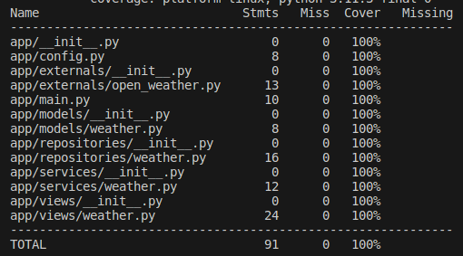
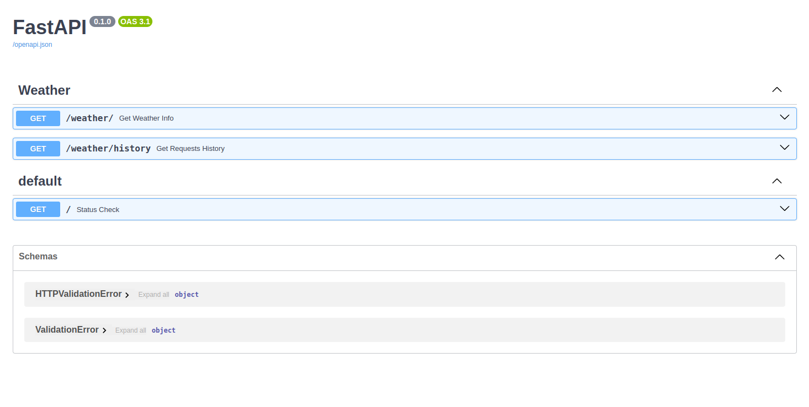
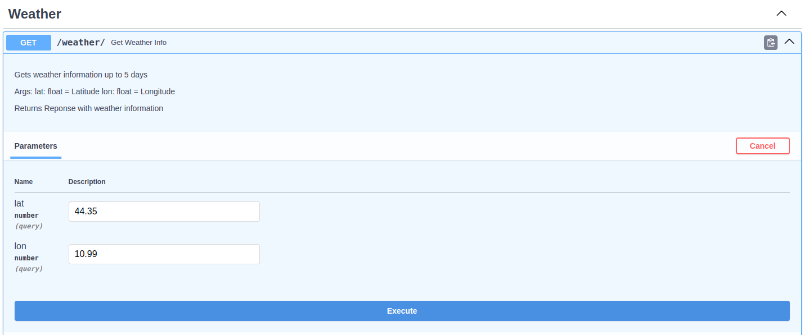
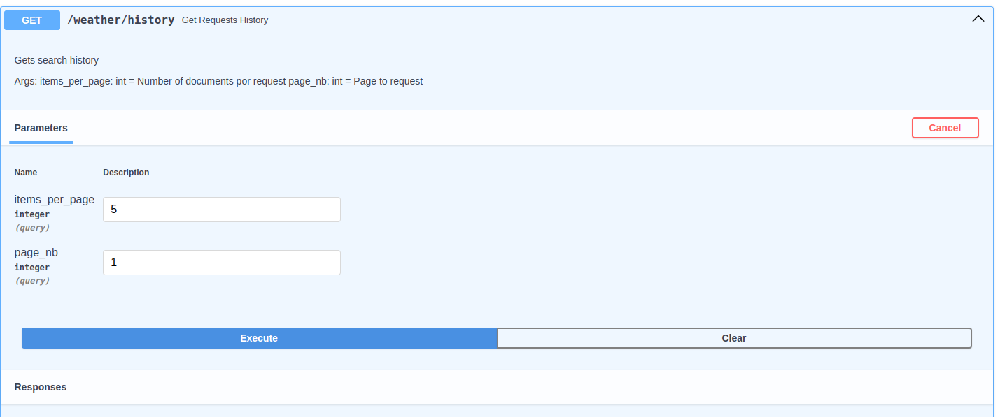

# Weather API Sync

This project is an interface for [OpenWeather API](https://openweathermap.org/) where we can retrieve weather data for free. It was developed using [FastAPI](https://fastapi.tiangolo.com/), [Mongoengine](http://mongoengine.org/) and some other libraries.

### How to run

Here are some steps to run this project

#### The easy way

After cloning the repository, you can use [Docker](https://www.docker.com/) to run with no extra configuration. But first you need a valid [open weather key](https://home.openweathermap.org/api_keys) and save the key into a file called `.env` at the project directory root.

```
OPEN_WEATHER_KEY=copy-your-key
```

Then, you can run the project by:

`docker compose up`

#### The hard way

Install pipenv

`pip install pipenv`

Then you need install the environment

`pipenv install --dev`

Make sure you set the right environment variables in `.env` file.

```
API_PORT=
OPEN_WEATHER_KEY=
OPEN_WEATHER_HOST=
DB_HOST=
DB_NAME=
```

So you can run using:

`pipenv run server`

### About tests

[Pytest](https://docs.pytest.org/en/7.4.x/) was used to make unit tests in this project. The coverage is as follows:



## How to use

Once the project configured and running. You can access http://localhost:8000/docs and you'll be able to see this page:



At the `/weather` endpoint, you can request the weather information for any place by provide latitude and longitude.



You can also read all request history by the `/weather/history`. This endpoint was configured to work with pagination for large amount of data purposes.


